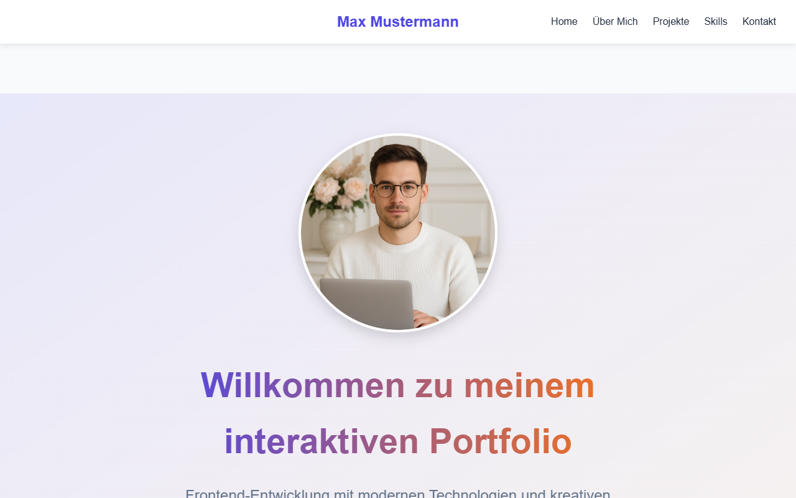
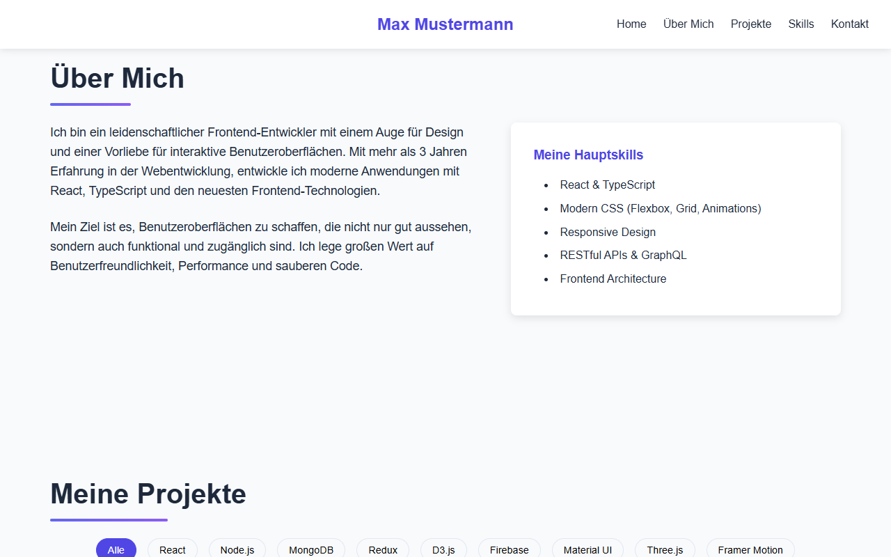
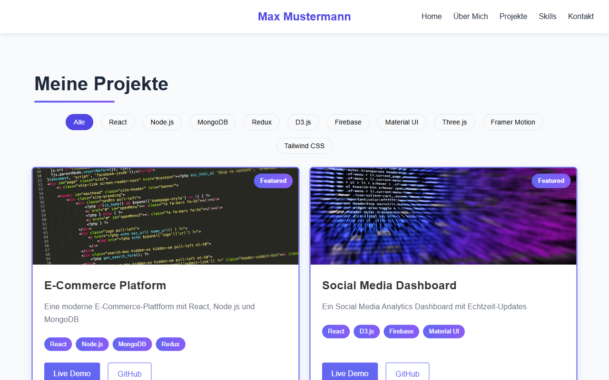
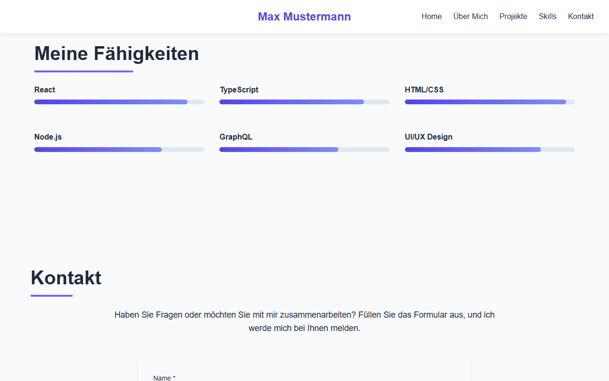
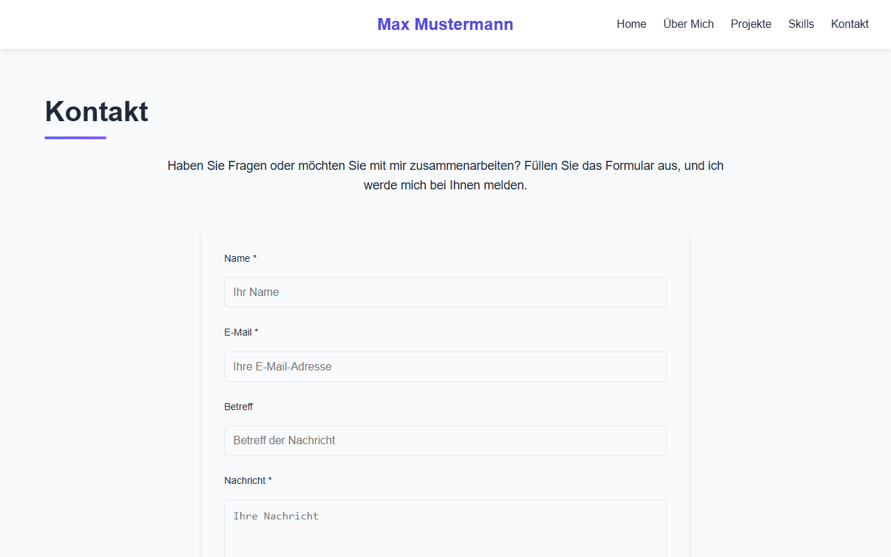
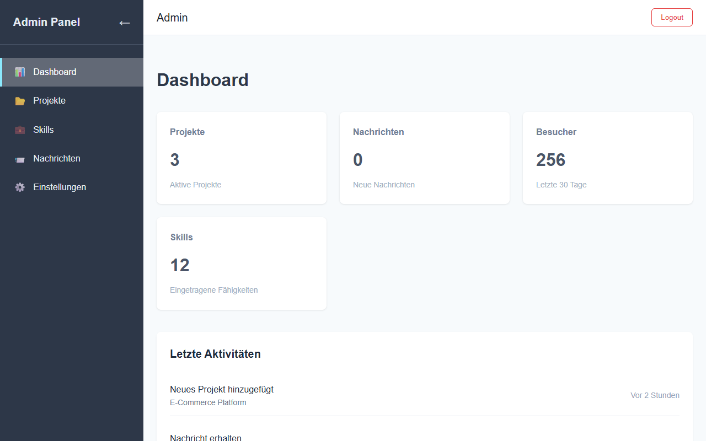
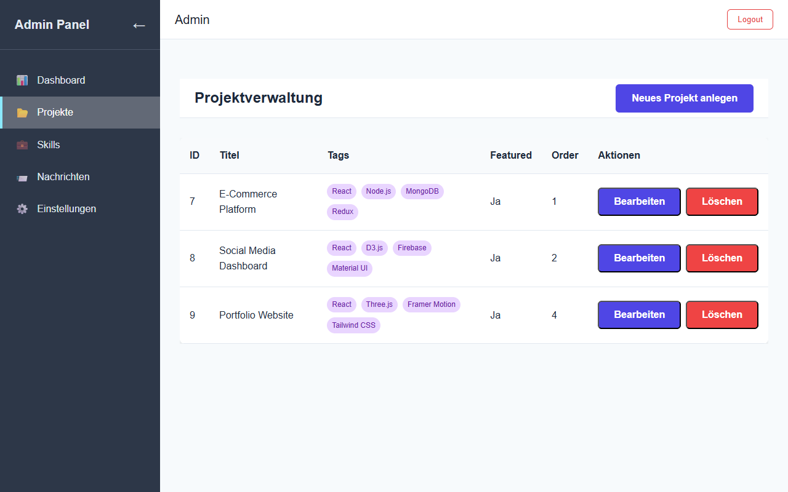
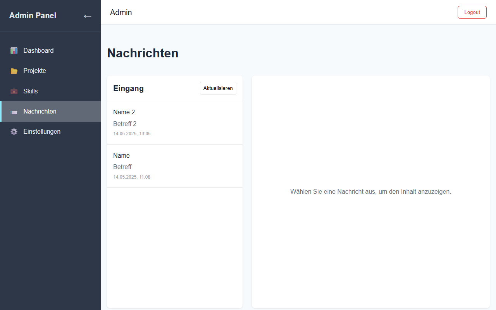

# Cool Interactive Portfolio

A modern, full-stack portfolio application built with **React**, **TypeScript**, and **Node.js**. This project features a responsive frontend with interactive components and animations, backed by a robust Express API and SQLite database.

## 🚀 Features

### 🖥️ Frontend

- **Modern UI Design**: Clean, responsive layout with custom animations and transitions.

- **Project Showcase**: Dynamic cards with filtering by technology.

- **Admin Dashboard**: Full-featured admin panel for managing content.

- **Contact Form**: Integrated form with backend validation and data storage.

- **Authentication**: Secure login system for admin access.

### 🧠 Backend

- **RESTful API**: Built with Express.js for managing data.

- **Database Integration**: SQLite via Prisma ORM.

- **JWT Authentication**: Token-based auth with protected routes.

- **File Uploads**: Upload and store project images using Multer.

- **Messaging System**: Handles contact form submissions and admin message management.

## 🛠️ Tech Stack

### Frontend

- React 18 + TypeScript

- React Router

- CSS3 (with custom animations)

- JWT (client-side auth)

- Fetch API

### Backend

- Node.js + Express

- TypeScript

- Prisma ORM

- SQLite

- Multer (file uploads)

- JWT (auth)

## 📁 Project Structure

### Frontend

- `src/pages`: Pages like Home, Projects, About, Contact, Admin.

- `src/components`: Reusable UI components.

- `src/layouts`: Layout components (e.g., `AdminLayout`).

- `src/contexts`: React contexts (e.g., `AuthContext`).

- `src/services`: API service functions.

- `src/hooks`: Custom hooks (`useProjects`, `useAuth`).

### Backend

- `src/controllers`: Route handlers for each API.

- `src/middleware`: Authentication and upload middleware.

- `src/routes`: Route definitions.

- `src/services`: Business logic and DB access.

- `src/utils`: Helper functions.

- `prisma`: Schema and migration files.

## ⚙️ Getting Started

### Prerequisites

- Node.js (v14+)

- npm or yarn

### Installation

1. Clone the repository:

```bash

git clone https://github.com/yourusername/cool-interactive-portfolio.git

cd cool-interactive-portfolio

```

2.  **Backend Setup:**

```bash

cd backend

npm install

npx prisma generate

npm run seed # Populate database with sample data

npm run dev # Start backend development server

```

3.  **Frontend Setup:**

```bash

cd ../frontend

npm install

npm run dev # Start frontend development server

```

4.  **Access the App:**

- Frontend: [http://localhost:3000](http://localhost:3000)

- Backend API: [http://localhost:5000](http://localhost:5000)

- Admin Panel: [http://localhost:3000/admin](http://localhost:3000/admin)

(Login with: `admin / admin123`)

## 📡 API Endpoints

### Auth

- `POST /api/auth/login` – Login user

- `GET /api/auth/profile` – Fetch authenticated user profile

### Projects

- `GET /api/projects` – List all projects

- `GET /api/projects/:id` – Get a single project

- `POST /api/projects` – Create a project (auth required)

- `PUT /api/projects/:id` – Update a project (auth required)

- `DELETE /api/projects/:id` – Delete a project (auth required)

### Messages

- `POST /api/messages` – Submit contact form

- `GET /api/messages` – Get all messages (auth required)

- `GET /api/messages/unread` – Count of unread messages (auth required)

- `PUT /api/messages/:id/read` – Mark message as read (auth required)

- `DELETE /api/messages/:id` – Delete message (auth required)

### Upload

- `POST /api/upload/image` – Upload project image (auth required)

## 🚀 Deployment

The application can be hosted on any Node.js-supported environment.

### Production Steps

1.  **Build frontend:**

```bash

cd frontend

npm run build

```

2.  **Configure environment variables in `.env`**

3.  **Start backend server:**

```bash

cd ../backend

npm run build

npm start

```


## 📸 App Preview

### Home


### About


### Projects


### Skills


### Contact


### Admin Dashboard


### Admin Projects


### Admin Messages


## 🔮 Future Enhancements

- Advanced project filtering/sorting

- Skill matrix with proficiency levels

- Integrated blog engine

- Theme customization (dark/light)

- Multi Language Support

- ...

## 📄 License

This project is licensed under the MIT License. See the LICENSE file for details.
